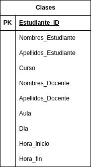

# Ejercicio Normalizacion

## 1FN

En la siguiente Forma Normal se atomizo Nombres y apellidos tanto de estudiantes como de Docentes, se atomizo el horario separando Dia, hora de inicio y hora de finalizacion para las clases, quedando tal que asi:

## 2FN, 3FN, 4FN

Se procedio a diseccionar cada atributo como Tablas independientes quedando como resultado 10 tablas, simultanemente se verifico la no dependencia transitiva en atributos de cada tabla asi como que los atributos dependieran de la totalidad de la llave primaria y no de una parte de ésta (en caso de ser una llave compuesta) asegurando así la 2FN y 3FN.

Para finalizar se comprobo que no existiesen Dependencias Multivaluadas de modo que a la hora de realizarse inserciones de informacion no ocurran redundancias o repeticiones de datos que extengan la informacion innecesariamente, cumpliendo con ello la 4FN.

Adicionalmente se realizaron las relaciones entre Tablas con su correcta cardinalidad prevista, dando como resultado el siguiente E-R UML

